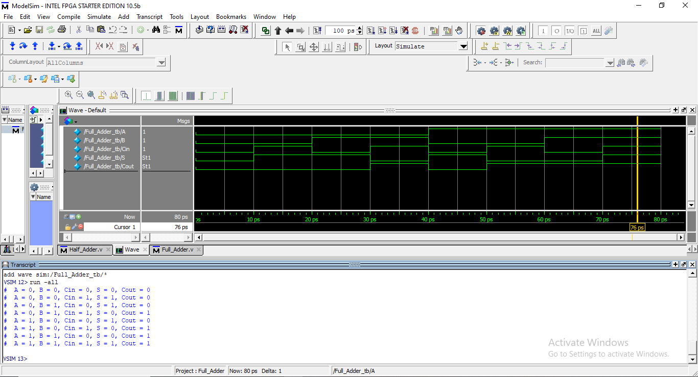

# Full Adder using Verilog HDL ⚡🧮

This module implements a 1-bit Full Adder using two Half Adders and an OR gate.
A Full Adder adds three input bits (A, B, Cin) and produces a Sum (S) and Carry Out (Cout).

## 📘 1. Module Explanation

A Full Adder is built using:

Half Adder 1 → Adds A and B

Half Adder 2 → Adds the previous sum with Cin

OR gate → Combines carry outputs of both Half Adders

This hierarchical design demonstrates modular coding practices in Verilog.

## 📊 2. Truth Table
| A | B | Cin | Sum (S) | Cout |
| - | - | --- | ------- | ---- |
| 0 | 0 | 0   | 0       | 0    |
| 0 | 0 | 1   | 1       | 0    |
| 0 | 1 | 0   | 1       | 0    |
| 0 | 1 | 1   | 0       | 1    |
| 1 | 0 | 0   | 1       | 0    |
| 1 | 0 | 1   | 0       | 1    |
| 1 | 1 | 0   | 0       | 1    |
| 1 | 1 | 1   | 1       | 1    |

## 🖥️ 3. Circuit Diagram

(Add your Full Adder circuit picture here, e.g.)

📷 4. Simulation Snapshot

(Add your simulation waveform screenshot here, e.g.)

🧩 5. Code Explanation
✔️ Full Adder Code

The Full Adder is created using:

Half Adder 1 to generate:

Intermediate sum → w1

Carry → w2

Half Adder 2 to add Cin

OR Gate combines carries → final Cout

module Full_Adder(output s, cout, input a,b,cin);

wire w1,w2,w3;

Half_Adder n1(w1,w2,a,b);     // First Half Adder
Half_Adder n2(s,w3,w1,cin);   // Second Half Adder
or n3(cout,w2,w3);            // OR gate for final carry

endmodule

✔️ Half Adder Code
module Half_Adder(output s, cout, input a,b);

xor n4(s,a,b);
and n5(cout,a,b);

endmodule

✔️ Testbench

The testbench tests all 8 possible input combinations.

module Full_Adder_tb;
reg A,B,Cin;
wire S,Cout;

Full_Adder dut(S,Cout,A,B,Cin);

initial
begin
A=0; B=0; Cin=0; #10; $display(" A=%b B=%b Cin=%b → S=%b Cout=%b",A,B,Cin,S,Cout);
A=0; B=0; Cin=1; #10; $display(" A=%b B=%b Cin=%b → S=%b Cout=%b",A,B,Cin,S,Cout);
A=0; B=1; Cin=0; #10; $display(" A=%b B=%b Cin=%b → S=%b Cout=%b",A,B,Cin,S,Cout);
A=0; B=1; Cin=1; #10; $display(" A=%b B=%b Cin=%b → S=%b Cout=%b",A,B,Cin,S,Cout);
A=1; B=0; Cin=0; #10; $display(" A=%b B=%b Cin=%b → S=%b Cout=%b",A,B,Cin,S,Cout);
A=1; B=0; Cin=1; #10; $display(" A=%b B=%b Cin=%b → S=%b Cout=%b",A,B,Cin,S,Cout);
A=1; B=1; Cin=0; #10; $display(" A=%b B=%b Cin=%b → S=%b Cout=%b",A,B,Cin,S,Cout);
A=1; B=1; Cin=1; #10; $display(" A=%b B=%b Cin=%b → S=%b Cout=%b",A,B,Cin,S,Cout);
end
endmodule

🎯 Conclusion

This Full Adder design demonstrates:

✔️ Modular Verilog coding
✔️ Reusability of components
✔️ Proper testbench design
✔️ Complete truth table verification