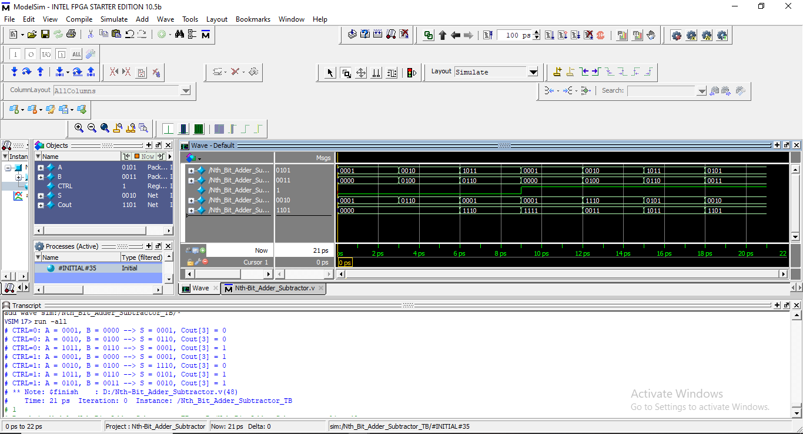

# ➕ 2's_Complement_Adder–Subtractor (Parameterized)

The 2's_Complement_Adder–Subtractor is a configurable arithmetic module that performs both addition and subtraction depending on the control signal.
This module is parameterized using:

parameter SIZE = 4

so it can easily scale to 4-bit, 8-bit, 16-bit, or any desired width.

## 🧠 1. Module Explanation

The design performs:

Addition when CTRL = 0

Subtraction when CTRL = 1

Inputs:

A → First operand (SIZE-bit)

B → Second operand (SIZE-bit)

CTRL → Mode control

0 → A + B

1 → A - B (using 2’s complement)

Outputs:

S → Sum / Difference

Cout → Carry out of each stage

Logic Used:

To perform subtraction, we convert B into its 2’s complement using:

Bc = B ⊕ CTRL  
Initial Carry = CTRL

So:

CTRL = 0 → B remains same → A + B

CTRL = 1 → B becomes ~B and carry-in adds +1 → A - B

## 📊 2. Operation Table (Addition vs Subtraction)

| CTRL | Operation   | Effective B | Meaning |
| ---- | ----------- | ----------- | ------- |
| 0    | Addition    | B           | A + B   |
| 1    | Subtraction | ~B + 1      | A – B   |

## 🧩 3. Architecture Overview

✔ Gate Function

For each bit:

Sum  = A ⊕ Bc ⊕ Cin
Cout = (A & Bc) | (Bc & Cin) | (Cin & A)

✔ Generate Block

Automatically creates (SIZE-1) remaining full adders:

for(g = 1; g < SIZE; g = g + 1)

This makes the design:

Scalable

Cleaner

Easy to modify

## 🔌 4. Circuit Concept (Insert Image)

📷 Add your block diagram or ripple-carry structure image here

## 🖥️ 5. Simulation Snapshot

📷 Add waveform or ModelSim console output here

## 🧾 6. Verilog Code Explanation

Full Adder RTL
assign {S,Cout} = {A^B^Cin,(A&B)|(B&Cin)|(Cin&A)};

Adder–Subtractor Logic
Bc[g] = B[g] ^ CTRL;   // XOR for complementing during subtraction

Carry Chaining
FA_RTL fa(S[g], Cout[g], A[g], Bc[g], Cout[g-1]);

Each stage’s carry ripples into the next → ripple-carry structure.

## ▶️ 7. Testbench Overview

The testbench applies:

Several values of A & B

Runs for both modes (ADD & SUB)

Uses $monitor to display outputs continuously

Operations Tested:

CTRL = 0 (Addition)

A = 1, B = 0

A = 2, B = 4

A = B, B = 6

A = 5, B = 3

CTRL = 1 (Subtraction)
Same sequence repeated.

Output Format:
CTRL=X: A=XXXX, B=XXXX → S=XXXX, Cout[3]=X

## 🎯 8. Learning Outcomes

This module helps beginners understand:

✔ How addition and subtraction are combined
✔ Role of XOR in 2’s complement operations
✔ Use of generate blocks for scalability
✔ Ripple-carry propagation
✔ RTL-level full adder implementation