# ➕ Multiplexers (MUX) – Complete Collection (2×1 → 16×1)

This repository contains a complete set of Multiplexer (MUX) designs in Verilog — starting from 2×1, scaling up to 16×1, and including hierarchical designs built using smaller MUXes (2×1, 4×1, 8×1).

A multiplexer is a fundamental combinational circuit that selects one input from multiple inputs based on select lines. MUXes are critical in:

✔ CPUs

✔ ALUs

✔ Signal-routing circuits

✔ Memory selection

✔ FPGA designs

✔ Digital control systems

This collection is beginner-friendly and ideal for learning structural design, Verilog coding, and hierarchical circuit construction.

## 🧠 1. What is a Multiplexer?

A multiplexer performs:

Y = Input[Select]

Where:

Inputs → Multiple data lines (2, 4, 8, 16...)

Select Lines → Choose which input to output

Output → One final selected value

MUXes work like digital switches that route one of many signals to the output.

## 🔢 2. MUX Size Scaling

| MUX Type | Number of Inputs | Select Lines |
| -------- | ---------------- | ------------ |
| 2×1      | 2 inputs         | 1 select     |
| 4×1      | 4 inputs         | 2 selects    |
| 8×1      | 8 inputs         | 3 selects    |
| 16×1     | 16 inputs        | 4 selects    |

Each time you double the number of inputs → you need one more select bit.

## 📂 3. Folder-Wise Breakdown

Each folder contains:

🧩 Circuit Diagram Placeholder

🖥️ Simulation Output Placeholder

📘 Explanation

### 📁 Mux_2x1

A basic 2-input multiplexer.

Logic:

Y = Sel ? B : A

🧩 Circuit Diagram

📷 Insert your image here
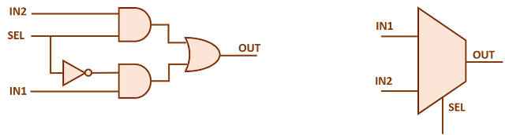

🖥️ Simulation Output

📷 Insert your waveform/output image here
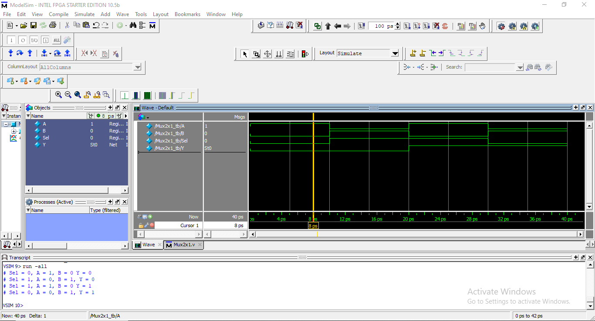

### 📁 Mux_4x1

A 4-input multiplexer using Sel[1:0].

🧩 Circuit Diagram

🖥️ Simulation Output

📷 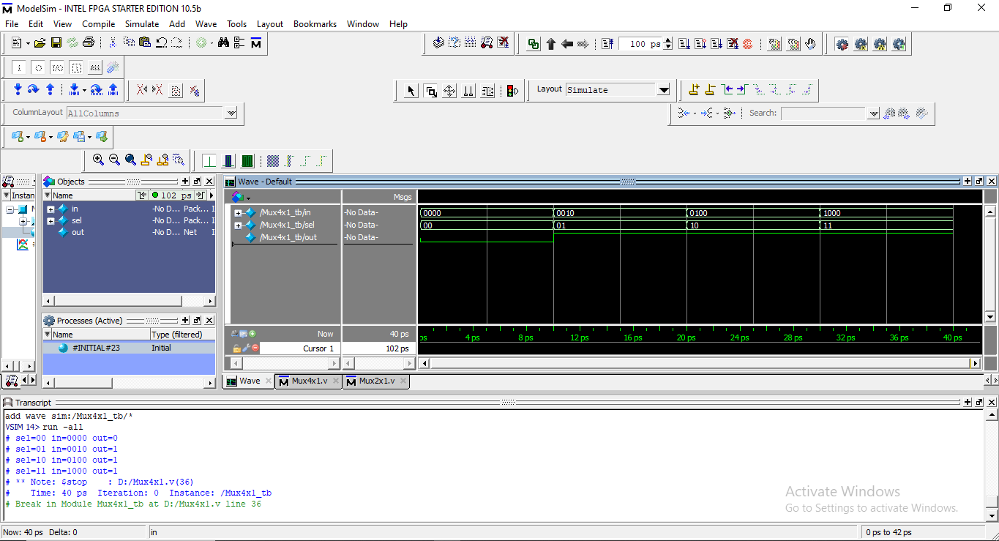

### 📁 Mux_4x1_By_Mux_2x1

A 4x1 MUX built using three 2x1 MUXes.

Hierarchy:

Level 1 → 2 × (2x1 MUX)

Level 2 → 1 × (2x1 MUX)

🧩 Circuit Diagram

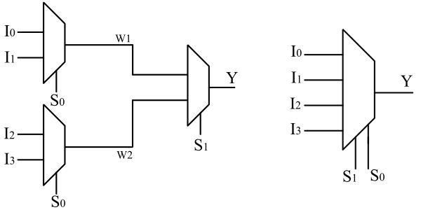

🖥️ Simulation Output

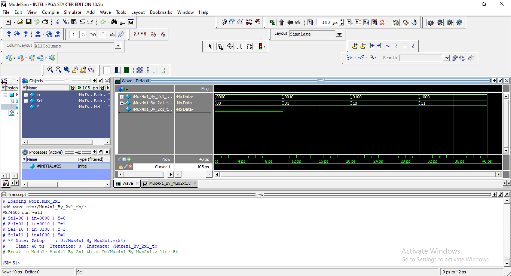

### 📁 Mux_8x1

An 8-input multiplexer controlled by 3 select bits.

🧩 Circuit Diagram

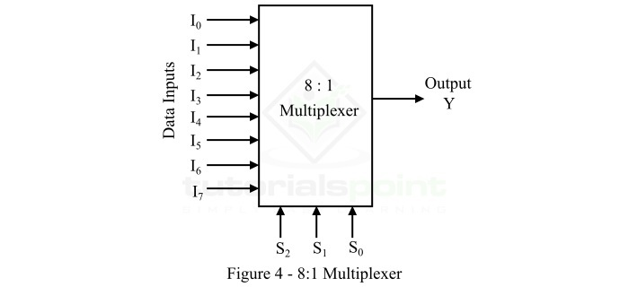

🖥️ Simulation Output

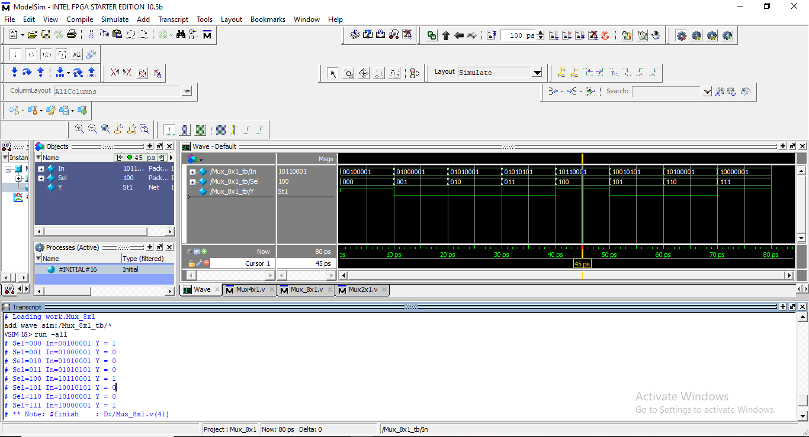

### 📁 Mux_8x1_By_Mux_2x1

Hierarchy using only 2x1 MUXes.

Structure:

4 MUX2 → 2 MUX2 → 1 MUX2

🧩 Circuit Diagram

🖥️ Simulation Output

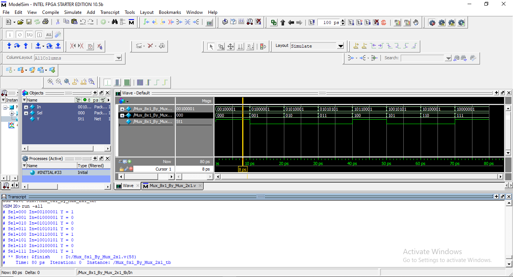

### 📁 Mux_8x1_By_Mux_4x1

Hierarchy using 4x1 and 2x1 MUXes.

🧩 Circuit Diagram

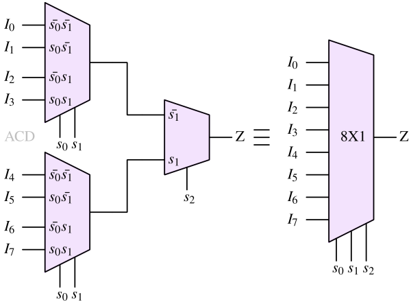

🖥️ Simulation Output

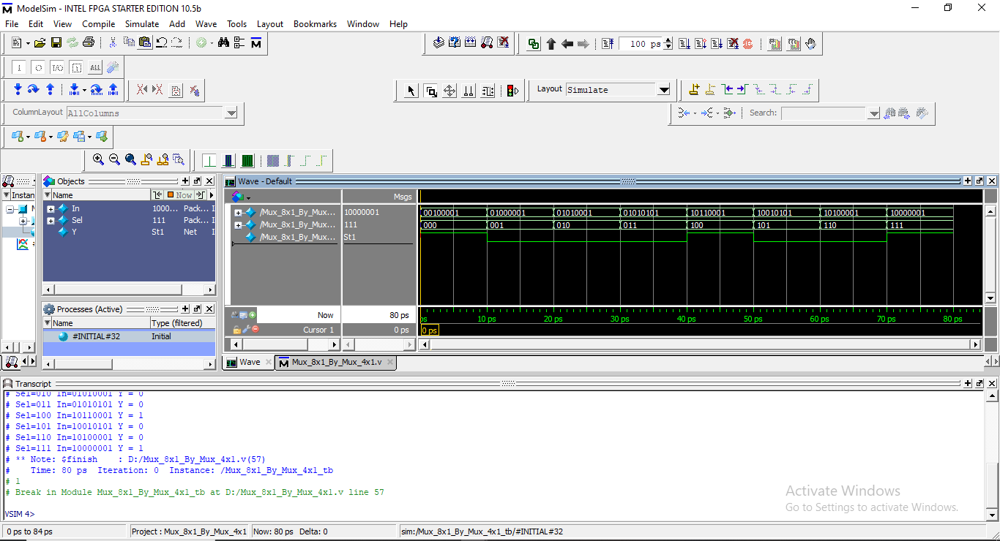

### 📁 Mux_16x1_By_Mux_8x1

Hierarchy using two 8x1 MUXes + one 2x1 MUX.

🧩 Circuit Diagram

📷 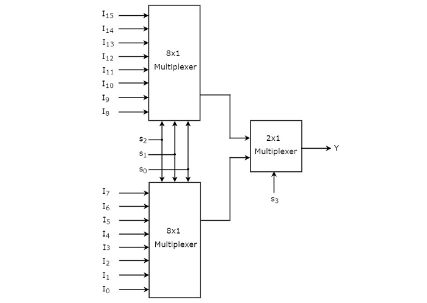

🖥️ Simulation Output

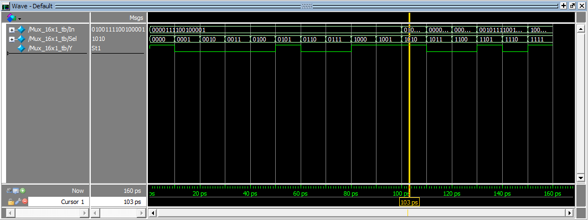

## 🧾 4. Learning Outcomes

By exploring all these modules, learners understand:

✔ How multiplexers select data
✔ How select lines map to input selection
✔ Structural vs. behavioral Verilog
✔ Hierarchical circuit building
✔ Modular design
✔ How large digital systems are constructed from small blocks
✔ How to write clean HDL and testbenches

## 🎯 5. Purpose of This Repository

This MUX collection is designed to help students and beginners learn:

Basic digital selection logic

Scalable circuit design

HDL representation of hardware

Real-world multiplexer applications in CPUs and ALUs

How to build complex circuits using smaller modules

This repository forms a strong foundation for digital design, combinational logic, and Verilog HDL.