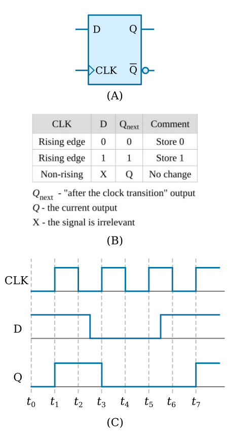

# ➡️ D Flip-Flop (Positive Edge Triggered)

The **D Flip-Flop (DFF)** is a fundamental **sequential digital circuit** used to store **one bit of data**. Unlike combinational logic, its output depends on both **current inputs** and **past state**. The value present at the **D input** is captured and stored at the **rising edge of the clock (posedge Clk)**.

This module also includes an **active-high synchronous reset (Rst)** and provides both **Q** and **Q̅ (complement)** outputs.

---

## 🧠 1. Module Explanation

The D Flip-Flop has the following signals:

### 🔹 Inputs

* **D**   → Data input
* **Clk** → Clock input (positive edge triggered)
* **Rst** → Synchronous reset (active high)

### 🔹 Outputs

* **Q**     → Stored output
* **Q_bar** → Complement of Q

### 🧩 Functional Behavior

* On every **positive edge of Clk**:

  * If **Rst = 1**, output **Q is reset to 0**
  * Else, **Q takes the value of D**
* **Q_bar** is always the logical inverse of Q

---

## ⏱️ 2. Timing / Truth Table (Edge-Based)

| Clk Edge | Rst | D | Q(next) | Q̅(next) |
| -------- | --- | - | ------- | -------- |
| ↑        | 1   | X | 0       | 1        |
| ↑        | 0   | 0 | 0       | 1        |
| ↑        | 0   | 1 | 1       | 0        |
| No edge  | X   | X | Q(prev) | Q̅(prev) |

> ⚠️ Output changes **only on the rising edge** of the clock

---

## 🔌 3. Circuit Diagram (Insert Image)

📷 Add your D Flip-Flop circuit diagram here


Example:

```
D_FF_Circuit_Diagram.png
```

[ D Flip-Flop Circuit Diagram ]

---

## 🖥️ 4. Simulation / Waveform Snapshot

📷 Add waveform or simulation output here


Example:

```
D_FF_Waveform.png
```

[ Simulation Output / Timing Diagram ]

---

## 🧾 5. Verilog Code Explanation

### 🔹 D Flip-Flop Logic

```verilog
always @(posedge Clk)
begin
  if (Rst)
    Q <= 1'b0;
  else
    Q <= D;
end
```

✔️ `posedge Clk` ensures edge-triggered behavior
✔️ Non-blocking assignment (`<=`) is used for sequential logic
✔️ Reset has **highest priority** on the clock edge

### 🔹 Complement Output

```verilog
assign Q_bar = ~Q;
```

✔️ Q̅ is continuously updated as the inverse of Q

---

## ▶️ 6. Testbench Overview

The testbench verifies:

* Reset functionality
* Data capturing on rising clock edges
* Proper generation of Q and Q̅

### 🔹 Clock Generation

```verilog
initial Clk = 0;
always #5 Clk = ~Clk;
```

✔️ Generates a clock with **10 time-unit period**

### 🔹 Test Scenarios

* Apply reset and observe Q reset to 0
* Change D before clock edge and verify capture
* Hold D constant across multiple edges

### 🔹 Sample Output Format

```
Rst = 0, Clk = 1, D = 1, Q = 1, Q_bar = 0
```

---

## 🎯 7. Purpose of This Module

This D Flip-Flop module helps in understanding:

✔️ Difference between combinational and sequential logic
✔️ Clocked storage elements
✔️ Synchronous reset behavior
✔️ Importance of non-blocking assignments
✔️ Foundation for registers, counters, FSMs, and pipelines

---

## 📌 Key Notes

* Edge-triggered storage element
* Reset is **synchronous**, not asynchronous
* Output updates only on **posedge Clk**
* Widely used in CPUs, registers, and digital systems

---

### 🚀 Author Note

This module is ideal for beginners learning **sequential logic design** and HDL-based modeling using **Verilog**.
