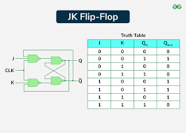
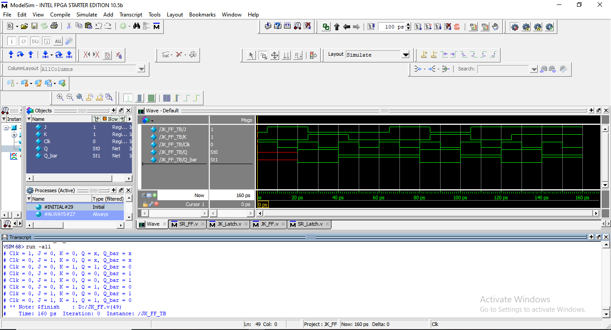

# 🔁 JK Flip-Flop (Clocked)

The **JK Flip-Flop** is a clocked sequential digital circuit that stores one bit of data. It is an edge-triggered version of the JK Latch, meaning the output updates **only on the rising edge of the clock**. Unlike the SR Flip-Flop, the JK Flip-Flop has **no invalid state**, making it more reliable for synchronous designs.

It produces:

- **Q** → Stored output  
- **Q̅ (Q_bar)** → Complement of Q  

This flip-flop is widely used in **counters, registers, and control logic**.

---

## 🧠 1. Module Explanation

The JK Flip-Flop has three inputs:

- **J (Set)** → Sets Q to logic 1  
- **K (Reset)** → Resets Q to logic 0  
- **Clk (Clock)** → Triggers state change on the **positive edge**

Outputs:

- **Q** → Stored state  
- **Q_bar** → Inverted stored state  

### Behavior (on `posedge Clk`):

- J = 0, K = 0 → Q holds previous value  
- J = 0, K = 1 → Q resets to 0  
- J = 1, K = 0 → Q sets to 1  
- J = 1, K = 1 → Q toggles its value  

---

## 📊 2. Truth Table (Evaluated on Rising Edge of Clock)

| J | K | Q(next) | Description |
|---|---|---------|-------------|
| 0 | 0 | Q(prev) | Hold        |
| 0 | 1 | 0       | Reset       |
| 1 | 0 | 1       | Set         |
| 1 | 1 | ~Q      | Toggle      |

---

## 🔌 3. Circuit Diagram

📷 

**Suggested file name:** `JK_FF_Circuit_Diagram.png`

---

## 🖥️ 4. Simulation Snapshot

📷 

**Suggested file name:** `JK_FF_Waveform.png`

---

## 🧾 5. Verilog Code Explanation

### Sequential Logic (Edge-Triggered)

```verilog
always @(posedge Clk)
begin
  if (J & K)
    Q <= ~Q;        // Toggle
  else if (J)
    Q <= 1'b1;      // Set
  else if (K)
    Q <= 1'b0;      // Reset
  else
    Q <= Q;         // Hold
end
Complement Output
verilog
Copy code
assign Q_bar = ~Q;
Key Notes
✔ Edge-triggered storage element
✔ No invalid input condition
✔ Toggle operation enables counter design
✔ Fully synchronous behavior

## ▶️ 6. Testbench Overview
The testbench applies all valid J–K input combinations synchronized with the clock:

* Hold condition (J=0, K=0)

* Set operation (J=1, K=0)

* Reset operation (J=0, K=1)

* Toggle operation (J=1, K=1)

The clock toggles every 10 time units to clearly observe edge-triggered state changes.

Example Output Format
ini
Copy code
Clk = 1, J = 1, K = 1, Q = 0, Q_bar = 1

## 🎯 7. Purpose of This Module
This JK Flip-Flop module helps in understanding:

Edge-triggered sequential logic

Difference between JK Latch and JK Flip-Flop

Toggle-based state transitions

Foundation for synchronous counters and registers

## ✍️ Author Note
This module is implemented as part of a systematic Verilog practice repository aimed at strengthening digital design fundamentals.

Design focus includes:

Clean and readable RTL coding

Proper clock usage

Explicit state handling

Beginner-friendly structure

This module is ideal for students and entry-level RTL designers.

## 🧷 Key Takeaways
JK Flip-Flop eliminates the invalid SR condition

Output changes only on clock edge

Toggle mode is essential for counters

Core building block of synchronous systems
