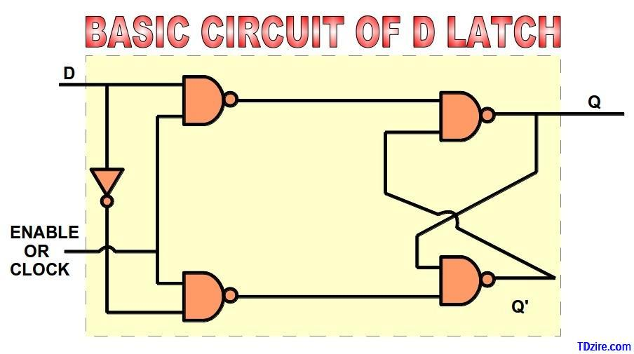
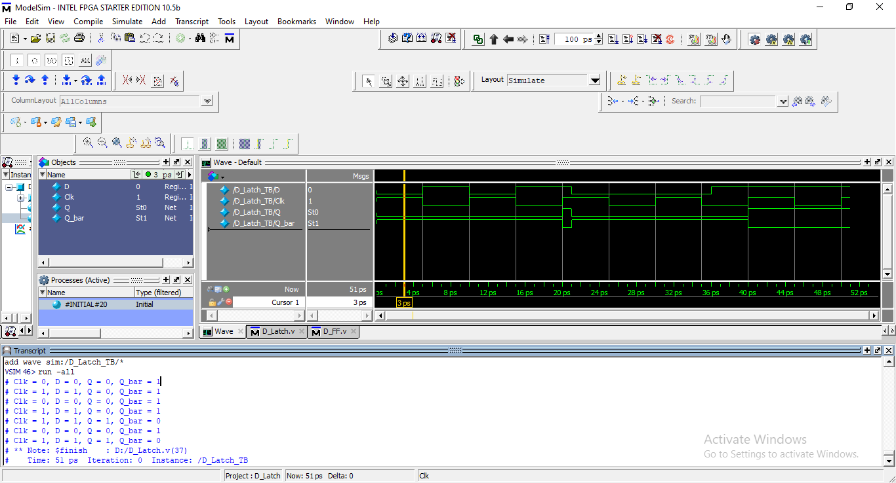

# ➡️ D Latch (Level-Sensitive)

The **D Latch** is a basic **level-sensitive sequential circuit** used to store **one bit of data**. Unlike a flip-flop, a D latch is **transparent when the clock (Clk) is HIGH**, meaning the output follows the input during this period. When the clock goes LOW, the output holds (latches) its last value.

This module also provides both **Q** and **Q̅ (complement)** outputs.

---

## 🧠 1. Module Explanation

The D Latch has the following signals:

### 🔹 Inputs

* **D**   → Data input
* **Clk** → Enable / Clock signal (level-sensitive)

### 🔹 Outputs

* **Q**     → Latched output
* **Q_bar** → Complement of Q

### 🧩 Functional Behavior

* When **Clk = 1 (HIGH)** → Latch is **transparent**, Q follows D
* When **Clk = 0 (LOW)** → Latch is **closed**, Q holds its previous value
* **Q_bar** is always the inverse of Q

---

## ⏱️ 2. Truth Table (Level-Based)

| Clk | D | Q(next) | Q̅(next)  |
| --- | - | ------- | -------- |
| 0   | X | Q(prev) | Q̅(prev)  |
| 1   | 0 | 0       | 1        |
| 1   | 1 | 1       | 0        |

> ⚠️ Output changes as long as **Clk remains HIGH**

---

## 🔌 3. Circuit Diagram (Insert Image)

📷 

Example:

```
D_Latch_Circuit_Diagram.png
```

[ D Latch Circuit Diagram ]

---

## 🖥️ 4. Simulation / Waveform Snapshot

📷 

Example:

```
D_Latch_Waveform.png
```

[ Simulation Output / Timing Diagram ]

---

## 🧾 5. Verilog Code Explanation

### 🔹 D Latch Logic

```verilog
always @(Clk, D)
begin
  if (Clk)
    Q <= D;
end
```

✔️ Sensitivity list makes the latch **level-sensitive**
✔️ When Clk is HIGH, Q updates immediately with D
✔️ When Clk is LOW, Q retains its last value

### 🔹 Complement Output

```verilog
assign Q_bar = ~Q;
```

✔️ Q̅ is continuously driven as the inverse of Q

---

## ▶️ 6. Testbench Overview

The testbench validates:

* Transparent behavior when Clk is HIGH
* Data holding when Clk is LOW
* Correct Q and Q̅ generation

### 🔹 Clock Generation

```verilog
initial Clk = 1;
always #5 Clk = ~Clk;
```

✔️ Generates a clock-like enable signal

### 🔹 Test Scenarios

* Toggle D while Clk = 1 → Q updates immediately
* Toggle D while Clk = 0 → Q remains unchanged

### 🔹 Sample Output Format

```
Clk = 1, D = 1, Q = 1, Q_bar = 0
```

---

## 🎯 7. Purpose of This Module

This D Latch module helps in understanding:

✔️ Difference between latches and flip-flops
✔️ Level-sensitive storage elements
✔️ Transparent vs hold behavior
✔️ Basic sequential logic modeling in Verilog

---

## 📌 Key Notes

* Level-sensitive (not edge-triggered)
* Can introduce **race conditions** if misused
* Commonly used in gated designs and low-level storage
* Forms the basis for building D Flip-Flops

---

### 🚀 Author Note

This module is ideal for beginners learning **latches**, **timing behavior**, and **sequential logic concepts** using Verilog HDL.
