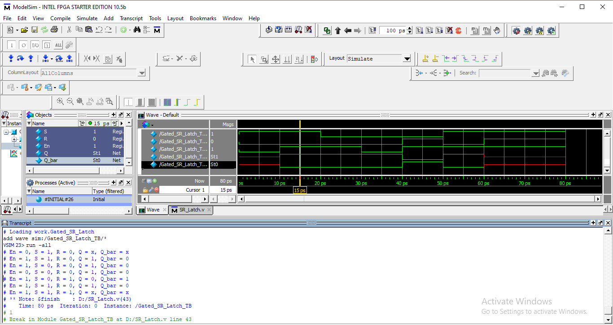

# ➡️ Gated SR Latch (Enable-Controlled)

The **Gated SR Latch** is a **level-sensitive sequential circuit** derived from the basic SR latch by adding an **Enable (En)** signal. The enable input controls when the latch is allowed to respond to the **Set (S)** and **Reset (R)** inputs. When disabled, the latch holds its previous state.

This design also provides both **Q** and **Q̅ (complement)** outputs.

---

## 🧠 1. Module Explanation

The Gated SR Latch has the following signals:

### 🔹 Inputs

* **S**  → Set input
* **R**  → Reset input
* **En** → Enable signal (active high)

### 🔹 Outputs

* **Q**     → Latched output
* **Q_bar** → Complement of Q

### 🧩 Functional Behavior

* When **En = 0** → Latch is **disabled** and holds its previous value
* When **En = 1** → Latch responds to S and R inputs

Priority behavior when **En = 1**:

* **S = 1, R = 0** → Q is set to 1
* **S = 0, R = 1** → Q is reset to 0
* **S = 0, R = 0** → No change (hold)
* **S = 1, R = 1** → **Invalid condition**, Q becomes unknown (X)

---

## ⏱️ 2. Truth Table (With Enable)

| En | S | R | Q(next) | Q̅(next) | Description |
| -- | - | - | ------- | -------- | ----------- |
| 0  | X | X | Q(prev) | Q̅(prev)  | Hold        |
| 1  | 0 | 0 | Q(prev) | Q̅(prev)  | No change   |
| 1  | 1 | 0 | 1       | 0        | Set         |
| 1  | 0 | 1 | 0       | 1        | Reset       |
| 1  | 1 | 1 | X       | X        | Invalid     |

---

## 🔌 3. Circuit Diagram (Insert Image)

📷 

Example:

```
Gated_SR_Latch_Circuit_Diagram.png
```

[ Gated SR Latch Circuit Diagram ]

---

## 🖥️ 4. Simulation / Waveform Snapshot

📷 

Example:

```
Gated_SR_Latch_Waveform.png
```

[ Simulation Output / Timing Diagram ]

---

## 🧾 5. Verilog Code Explanation

### 🔹 Gated SR Latch Logic

```verilog
always @(En, S, R)
begin
  if (!En)
    Q = Q;            // Hold state
  else if (S & R)
    Q = 1'bx;         // Invalid condition
  else if (S)
    Q = 1'b1;         // Set
  else if (R)
    Q = 1'b0;         // Reset
  else
    Q = Q;            // Hold
end
```

✔️ Sensitivity list makes the latch **level-sensitive**
✔️ Enable controls whether latch responds or holds
✔️ Invalid SR condition is explicitly modeled

### 🔹 Complement Output

```verilog
assign Q_bar = ~Q;
```

✔️ Q̅ continuously reflects the inverse of Q

---

## ▶️ 6. Testbench Overview

The testbench verifies:

* Enable-controlled behavior
* Set, Reset, and Hold operations
* Invalid SR condition handling

### 🔹 Test Scenarios Covered

* En = 0 → Output holds regardless of S and R
* En = 1, S = 1 → Set operation
* En = 1, R = 1 → Reset operation
* En = 1, S = R = 1 → Invalid state

### 🔹 Sample Output Format

```
En = 1, S = 0, R = 1, Q = 0, Q_bar = 1
```

---

## 🎯 7. Purpose of This Module

This Gated SR Latch module helps in understanding:

✔️ How enable signals control latch behavior
✔️ Difference between basic and gated SR latches
✔️ Invalid states in sequential logic
✔️ Level-sensitive storage elements

---

## 📌 Key Notes

* Level-sensitive latch (not edge-triggered)
* Enable must be carefully controlled to avoid hazards
* S = R = 1 is an illegal condition
* Forms the conceptual basis for D Latches and Flip-Flops

---

### 🚀 Author Note

This module is ideal for learning **SR latch behavior**, **enable-controlled storage**, and **fundamental sequential logic design** using Verilog HDL.
