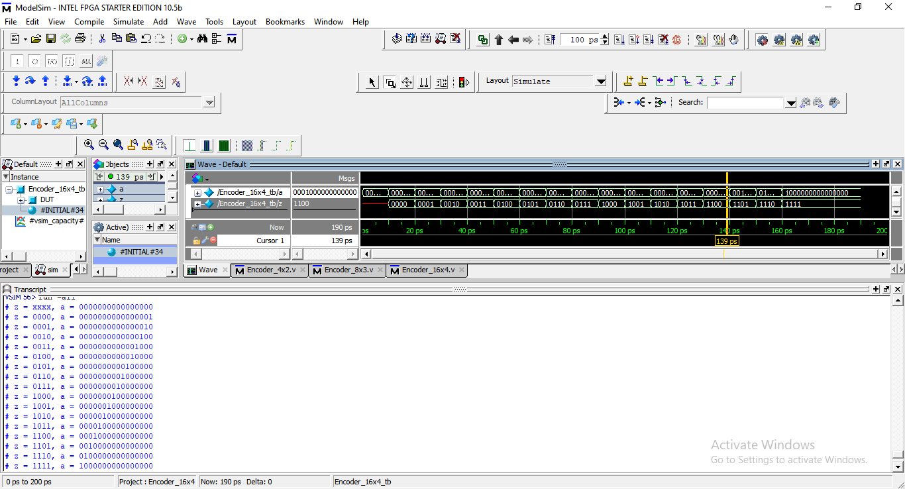
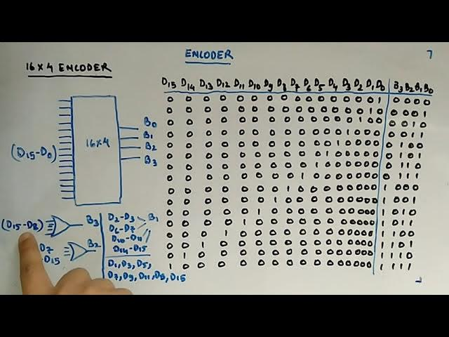

# 🔢 16×4 Encoder (Verilog)

## 📘 Overview
The **16×4 Encoder** is a **combinational digital circuit** that converts a **one-hot 16-bit input** into a **4-bit binary output**. For correct operation, **only one input line must be HIGH at any time**.

This type of encoder is commonly used in:
- Address encoding
- Interrupt and priority systems
- Control signal generation
- Data compression logic

---

## 🔌 Module Description

### Inputs
| Signal | Width | Description |
|------|------|------------|
| `a` | 16-bit | One-hot input vector |

### Outputs
| Signal | Width | Description |
|------|------|------------|
| `z` | 4-bit | Encoded binary output |

---

## Output_Wavefoam



---
## Ckt_Diagram



---

## ⚙️ Functional Behavior

### Input–Output Mapping
Each active input bit corresponds to a unique 4-bit binary code:

- `a = 0000_0000_0000_0001` → `z = 0000`
- `a = 0000_0000_0000_0010` → `z = 0001`
- `a = 0000_0000_0000_0100` → `z = 0010`
- `a = 0000_0000_0000_1000` → `z = 0011`
- `a = 0000_0000_0001_0000` → `z = 0100`
- `a = 0000_0000_0010_0000` → `z = 0101`
- `a = 0000_0000_0100_0000` → `z = 0110`
- `a = 0000_0000_1000_0000` → `z = 0111`
- `a = 0000_0001_0000_0000` → `z = 1000`
- `a = 0000_0010_0000_0000` → `z = 1001`
- `a = 0000_0100_0000_0000` → `z = 1010`
- `a = 0000_1000_0000_0000` → `z = 1011`
- `a = 0001_0000_0000_0000` → `z = 1100`
- `a = 0010_0000_0000_0000` → `z = 1101`
- `a = 0100_0000_0000_0000` → `z = 1110`
- `a = 1000_0000_0000_0000` → `z = 1111`

Invalid inputs (no bits or multiple bits HIGH) produce:

z = xxxx


---

## 📊 Truth Table (Summary)

| Active Input Bit | Output `z` |
| ---------------- | ---------- |
| a[0]             | 0000       |
| a[1]             | 0001       |
| a[2]             | 0010       |
| a[3]             | 0011       |
| a[4]             | 0100       |
| a[5]             | 0101       |
| a[6]             | 0110       |
| a[7]             | 0111       |
| a[8]             | 1000       |
| a[9]             | 1001       |
| a[10]            | 1010       |
| a[11]            | 1011       |
| a[12]            | 1100       |
| a[13]            | 1101       |
| a[14]            | 1110       |
| a[15]            | 1111       |

---

## 🧠 Verilog Code Explanation

### Combinational Logic
```verilog
always @(a)
begin
  case (a)
    16'b0000000000000001 : z = 4'b0000;
    16'b0000000000000010 : z = 4'b0001;
    16'b0000000000000100 : z = 4'b0010;
    ...
    16'b1000000000000000 : z = 4'b1111;
    default              : z = 4'bxxxx;
  endcase
end

## ▶️ Testbench Overview

The testbench applies:

An invalid input (a = 0)

All valid one-hot input combinations

Each case prints the encoded output using $display.

Example Output
Always show details
z = 1010, a = 0000010000000000

## 🎯 Purpose of This Module

This module helps in understanding:

Large-scale encoder design

One-hot to binary conversion

Case-based combinational modeling

Handling invalid input conditions

## ✍️ Author Note

This encoder is implemented as part of a systematic Verilog practice repository focused on strengthening combinational logic and RTL fundamentals.

## 🧷 Key Takeaways

* Only one input bit should be HIGH
* Invalid inputs produce unknown output
* Encoders reduce signal width significantly
* Foundational block for control and address logic