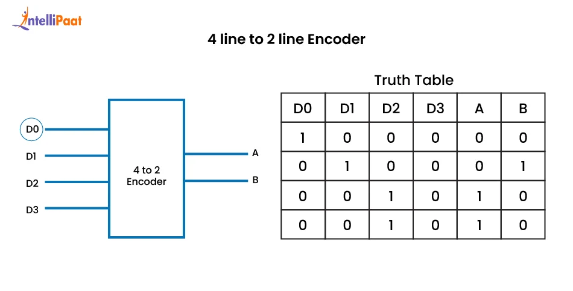

# Create README_Encoder_4x2.md file

content = """# 🔢 4×2 Encoder (Verilog)

## 📘 Overview
The **4×2 Encoder** is a **combinational digital circuit** that converts a **one-hot 4-bit input** into a **2-bit binary output**.  
Only one input line must be HIGH at a time for correct operation.

Encoders are commonly used in:
- Keyboard encoding  
- Interrupt priority systems  
- Data compression logic  
- Address and control signal generation  

---

## Output

## Ckt Diagram

## 🔌 Module Description

### Inputs
| Signal | Width | Description |
|------|------|------------|
| `a` | 4-bit | One-hot input vector |

### Outputs
| Signal | Width | Description |
|------|------|------------|
| `z` | 2-bit | Encoded binary output |

---

## ⚙️ Functional Behavior
The encoder maps a single HIGH input to its corresponding binary index.

**Input–Output Mapping:**
- `a = 0001` → `z = 00`
- `a = 0010` → `z = 01`
- `a = 0100` → `z = 10`
- `a = 1000` → `z = 11`

If the input is invalid (no bits or multiple bits HIGH), the output is set to **unknown (`xx`)**.

---

## 📊 Truth Table

| Input `a` | Output `z` |
|---------|-----------|
| 0001 | 00 |
| 0010 | 01 |
| 0100 | 10 |
| 1000 | 11 |
| Others | xx |

---

## 🧠 Verilog Design Notes
- Implemented using a `case` statement  
- Fully **combinational logic**  
- No clock signal required  
- Default case handles invalid input conditions  

---

## 🧪 Testbench Summary
The testbench applies all **valid one-hot input combinations** and prints the encoded output using `$display`.

**Example Output Format:**
z = 10, a = 0100

---

## ✅ Key Features
✔ One-hot to binary encoding  
✔ Simple and readable RTL  
✔ Explicit invalid-state handling  
✔ Suitable for synthesis and simulation  

---

## 📌 Learning Outcome
This module helps in understanding:
- Encoder fundamentals  
- One-hot input assumptions  
- Case-based combinational logic  
- Difference between encoders and decoders  

---

## ✍️ Author Note
This encoder is part of a structured **Verilog practice repository** focused on strengthening **digital design fundamentals** using clean and beginner-friendly RTL code.

---

## 🧷 Key Takeaways
- Only one input must be HIGH at a time  
- Invalid inputs produce undefined output  
- Encoders reduce signal width  
- Widely used in control and interface logic

