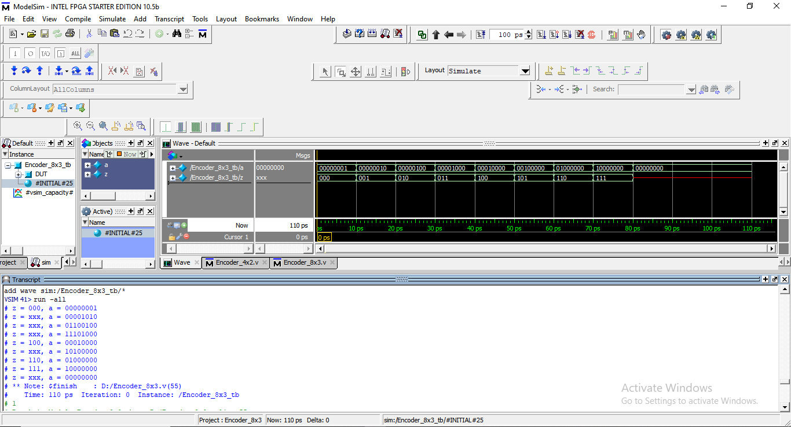
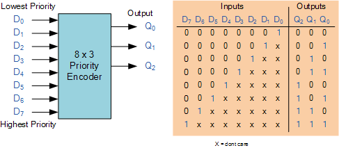

# 🔢 8×3 Encoder (Verilog)

## 📘 Overview
The **8×3 Encoder** is a **combinational digital circuit** that converts a **one-hot 8-bit input** into a **3-bit binary output**. Only **one input line must be HIGH at a time** for correct encoding.

Encoders are commonly used in:
- Priority and interrupt systems
- Keyboard and keypad encoding
- Data compression
- Address and control logic

---

## 🔌 Module Description

### Inputs
| Signal | Width | Description |
|------|------|------------|
| `a` | 8-bit | One-hot input vector |

### Outputs
| Signal | Width | Description |
|------|------|------------|
| `z` | 3-bit | Encoded binary output |

---
## Output_Wavefoam



---
## Ckt_Diagram



---

## ⚙️ Functional Behavior

### Input–Output Mapping
- `a = 00000001` → `z = 000`
- `a = 00000010` → `z = 001`
- `a = 00000100` → `z = 010`
- `a = 00001000` → `z = 011`
- `a = 00010000` → `z = 100`
- `a = 00100000` → `z = 101`
- `a = 01000000` → `z = 110`
- `a = 10000000` → `z = 111`
- Invalid input → `z = xxx`

---

## 📊 Truth Table

| Input `a`        | Output `z` |
|------------------|------------|
| 00000001 | 000 |
| 00000010 | 001 |
| 00000100 | 010 |
| 00001000 | 011 |
| 00010000 | 100 |
| 00100000 | 101 |
| 01000000 | 110 |
| 10000000 | 111 |
| Others   | xxx |

---

## 🧠 Verilog Code Explanation

### Combinational Logic
```verilog
always @(a)
begin
  case (a)
    8'b00000001 : z = 3'b000;
    8'b00000010 : z = 3'b001;
    8'b00000100 : z = 3'b010;
    8'b00001000 : z = 3'b011;
    8'b00010000 : z = 3'b100;
    8'b00100000 : z = 3'b101;
    8'b01000000 : z = 3'b110;
    8'b10000000 : z = 3'b111;
    default     : z = 3'bxxx;
  endcase
end
```

---

## ▶️ Testbench Overview
The testbench applies all valid one-hot input combinations along with an invalid case (`a = 00000000`) to verify encoder behavior.

### Example Output
```
z = 101, a = 00100000
```

---

## 🎯 Purpose of This Module
This module helps in understanding:
- Multi-input encoder design
- One-hot input assumptions
- Case-based combinational modeling
- Handling invalid input states

---

## ✍️ Author Note
This encoder is implemented as part of a **systematic Verilog practice repository** focused on building strong fundamentals in **combinational logic and RTL design**.

---

## 🧷 Key Takeaways
- Only one input bit should be HIGH
- Invalid inputs produce unknown output
- Encoders reduce signal width
- Core building block for control logic
