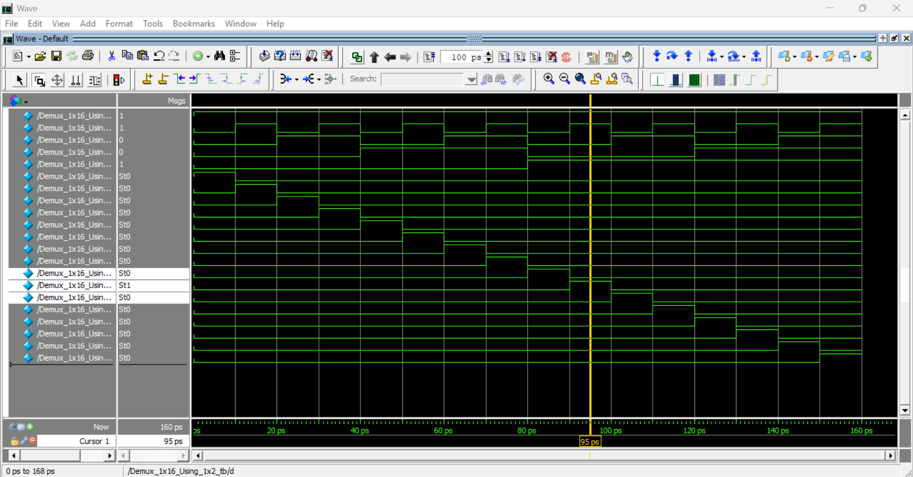
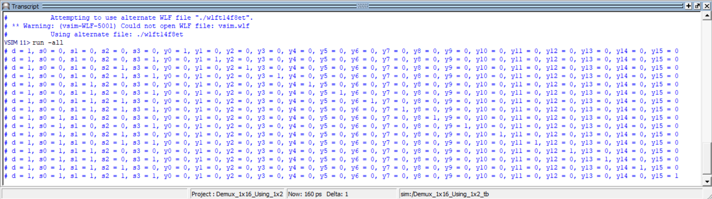

# Demux 1x16 Using 1x2 (Verilog)

## 📌 Overview
This project implements a **1×16 Demultiplexer** using multiple **1×2 demultiplexer** modules in a hierarchical structure.  
It demonstrates scalable digital design by cascading small building blocks to create a larger demux.

## 🧩 Modules Included

### 1️⃣ Demux_1x2
Basic 1×2 demultiplexer that routes input `d` to one of two outputs based on select line `s`.

### 2️⃣ Demux_1x16_Using_1x2
A 1×16 demultiplexer built using **15 instances** of the 1×2 demux arranged in stages:
- Stage 1: Controlled by `s3`
- Stage 2: Controlled by `s2`
- Stage 3: Controlled by `s1`
- Stage 4: Controlled by `s0`

### 3️⃣ Testbench
The testbench:
- Applies all select line combinations
- Keeps data input `d = 1`
- Uses `$display` to verify correct output activation

## 🔢 Inputs & Outputs

**Inputs**
- `d` : Data input
- `s3 s2 s1 s0` : Select lines

**Outputs**
- `y0` to `y15` : Demultiplexed outputs (one-hot)

## ✅ Expected Behavior
- Only **one output** is HIGH for each select combination
- Output index corresponds to binary value of `s3s2s1s0`
- Example: `s3s2s1s0 = 0101 → y5 = 1`

## 🎯 Learning Objectives
- Hierarchical RTL design
- Modular Verilog coding
- Demultiplexer scalability
- One-hot output verification

## 🛠️ Tools
- Verilog HDL
- Any simulator (ModelSim, Icarus Verilog, Vivado)

## ✍️ Author Note
This module is part of a structured Verilog practice series focused on strengthening **combinational logic**, **design reuse**, and **digital system scalability**.

## Output Wavefoam

## Truth Table

