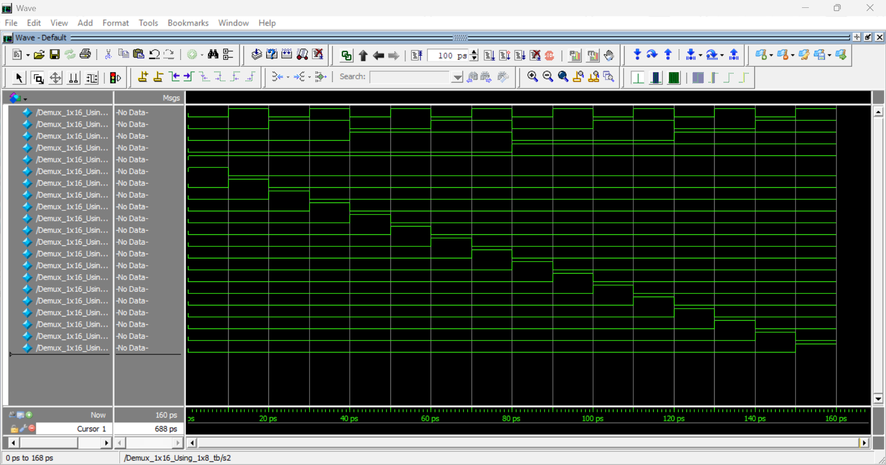
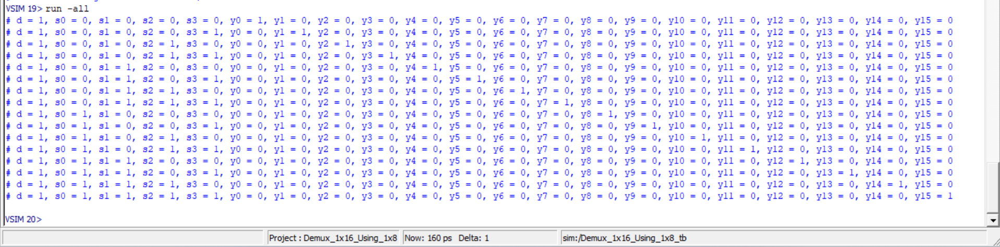

# 1×16 Demultiplexer Using 1×8 and 1×2 Demux (Verilog)

## 📌 Overview
This project implements a **1×16 Demultiplexer** using hierarchical design in **Verilog HDL**.  
The design is built by composing smaller demultiplexer modules (**1×2** and **1×8**) to demonstrate modular and scalable digital design practices.

A comprehensive **testbench** is also included to verify correct functionality for all select-line combinations.

---

## 🧩 Modules Description

### 🔹 1×2 Demultiplexer
Routes a single input `d` to one of two outputs based on select line `s`.

**Logic:**
- `y0 = d & ~s`
- `y1 = d & s`

---

### 🔹 1×8 Demultiplexer
Routes input `d` to one of eight outputs using three select lines (`s0`, `s1`, `s2`).

Each output corresponds to a unique combination of select signals.

---

### 🔹 1×16 Demultiplexer (Using 1×8)
The top-level module:
- Uses **two 1×8 demultiplexers**
- Uses **one 1×2 demultiplexer**
- `s0` selects between the two 1×8 blocks
- `s1, s2, s3` select outputs within each block

This hierarchical approach improves readability and scalability.

---

## 🧪 Testbench
The testbench:
- Applies all possible combinations of select lines (`s0–s3`)
- Keeps data input `d = 1`
- Uses `$display` to print output results
- Verifies that **only one output is HIGH at a time**

---

## ▶️ How to Simulate
1. Open ModelSim / Questa / Vivado / Icarus Verilog
2. Compile the Verilog file
3. Run the testbench module:
4. Observe console output

---

## ✅ Expected Behavior
For every unique select-line combination:
- Exactly **one output (`y0–y15`) is HIGH**
- All other outputs remain LOW

---

## 🎯 Key Learning Outcomes
- Hierarchical digital design
- Demultiplexer fundamentals
- Modular Verilog coding style
- Testbench-based verification

---

## 🧠 Author Note
This design is part of a structured Verilog practice series aimed at building strong fundamentals in **combinational logic** and **scalable hardware design**.

---

## Output WaveFoam

## Truth Table 

