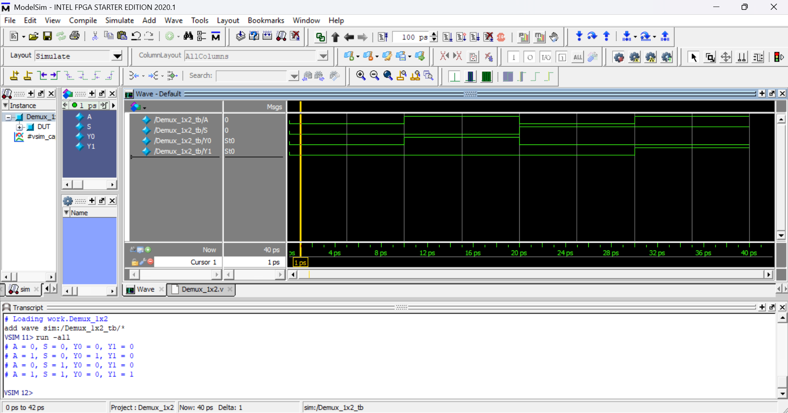
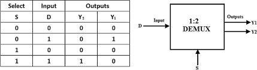

# 🔀 1×2 Demultiplexer (Verilog)

## 📘 Overview
The **1×2 Demultiplexer (Demux)** is a **combinational digital circuit** that takes a **single data input** and routes it to **one of two outputs** based on the select line.

Demultiplexers are commonly used in:
- Data routing
- Control signal distribution
- Communication systems
- Address decoding logic

---

## 🔌 Module Description

### Inputs
| Signal | Width | Description |
|------|------|------------|
| `A` | 1-bit | Data input |
| `S` | 1-bit | Select line |

### Outputs
| Signal | Width | Description |
|------|------|------------|
| `Y0` | 1-bit | Output when `S = 0` |
| `Y1` | 1-bit | Output when `S = 1` |

---

## Output Wavefoam



## Truth Table And Ckt_Diagram



---

## ⚙️ Functional Behavior

- When `S = 0`, input `A` is routed to `Y0`
- When `S = 1`, input `A` is routed to `Y1`
- The inactive output remains **LOW (0)**

---

## 📊 Truth Table

| A | S | Y0 | Y1 |
|---|---|----|----|
| 0 | 0 | 0 | 0 |
| 1 | 0 | 1 | 0 |
| 0 | 1 | 0 | 0 |
| 1 | 1 | 0 | 1 |

---

## ▶️ Testbench Overview

The testbench applies all possible combinations of inputs `A` and select line `S`.

Each test case prints the output using the `$display` system task.

### Example Output
```text
A = 1, S = 0, Y0 = 1, Y1 = 0
```

---

## 🎯 Purpose of This Module

This module helps in understanding:

- Basic demultiplexer operation  
- Select-based data routing  
- Combinational logic modeling  
- RTL testbench writing  

---

## ✍️ Author Note

This demultiplexer is implemented as part of a **systematic Verilog practice repository** aimed at building **strong RTL and digital design fundamentals**.

---

## 🧷 Key Takeaways

- Demultiplexers route **one input to multiple outputs**
- Select line determines **active output**
- Only **one output is active at a time**
- Essential building block for **data path design**
