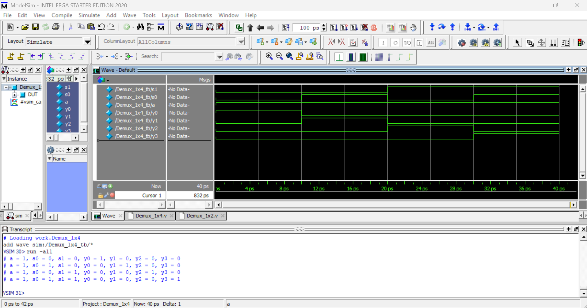
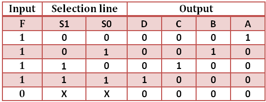

# Demux 1x4 (1-to-4 Demultiplexer) – Verilog Implementation

## 📌 Overview

This project implements a **1x4 Demultiplexer** using **combinational logic** in Verilog.  
A demultiplexer routes a single input signal to one of multiple outputs based on select lines.

This design uses **continuous assign statements** for clarity and simplicity.

---

## 🧠 Module Description

### 🔹 Demux_1x4

**Inputs**
- `a`   : Data input
- `s1`  : Select line (MSB)
- `s0`  : Select line (LSB)

**Outputs**
- `y0`, `y1`, `y2`, `y3` : Demultiplexer outputs

Only **one output is active (HIGH)** at a time depending on the select inputs.

---

## ⚙️ Functional Behavior

| s1 | s0 | Active Output |
|----|----|---------------|
| 0  | 0  | y0            |
| 0  | 1  | y1            |
| 1  | 0  | y2            |
| 1  | 1  | y3            |

If `a = 0`, all outputs remain `0`.

---
## Output Wavefoam

## Truth Table And Ckt_Diagram

---

## ▶️ Testbench Overview

The testbench:
- Applies `a = 1`
- Cycles through all combinations of `s1` and `s0`
- Prints the output using `$display`

### Example Output
a = 1, s0 = 0, s1 = 1, y0 = 0, y1 = 0, y2 = 1, y3 = 0

---

## 🎯 Purpose of This Module

This module helps in understanding:
- Demultiplexer fundamentals
- Data routing using select lines
- Combinational logic using assign statements
- RTL-level signal decoding

---

## ✍️ Author Note

This demultiplexer is implemented as part of a **systematic Verilog practice repository** focused on strengthening:
- Digital design basics
- RTL coding style
- Clear and readable hardware modeling

---

## 🧷 Key Takeaways

- Only one output is active at a time
- Select lines control data routing
- Simple logic can replace procedural blocks
- Demultiplexers are widely used in control and data-path logic