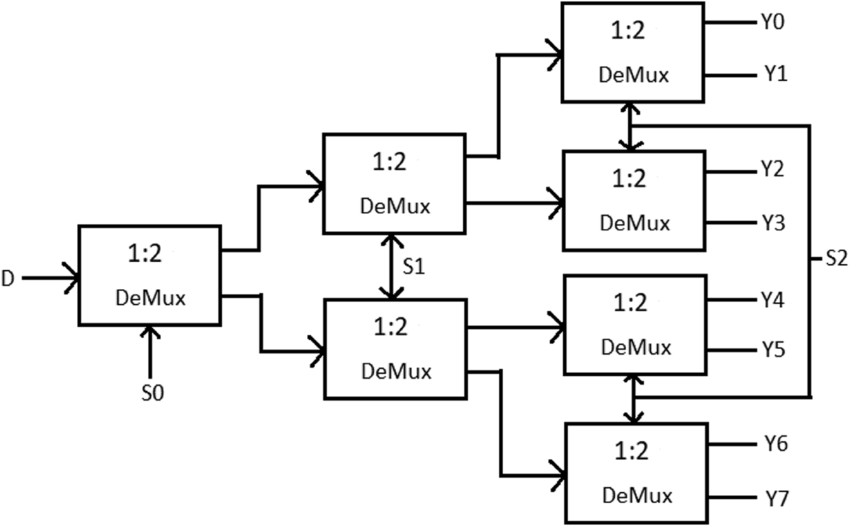
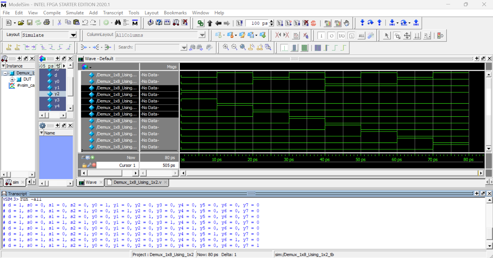

# 🔀 1x8 Demultiplexer Using 1x2 Demux (Hierarchical Design)

This project implements a **1x8 Demultiplexer** by hierarchically cascading multiple **1x2 Demultiplexer** modules.  
It demonstrates **modular design**, **hierarchical RTL construction**, and **signal routing using select lines**.

---

## 🧠 1. Module Overview

### 🔹 Base Module: Demux_1x2

**Function:**  
Routes a single data input to one of two outputs based on a select line.

#### Inputs
- **d** : Data input  
- **s** : Select line  

#### Outputs
- **y0, y1**

#### Logic
- `y0 = ~s & d`
- `y1 =  s & d`

---

### 🔹 Top Module: Demux_1x8_Using_1x2

This module builds a **1x8 demultiplexer** using **seven 1x2 demux blocks**.

#### Inputs
- **d** : Data input  
- **s2, s1, s0** : Select lines  

#### Outputs
- **y0 – y7**

---

## ⚙️ 2. Hierarchical Architecture

The design works in **three stages**:

### Stage 1 (LSB Selection)
- `s0` selects between two intermediate paths

### Stage 2 (Middle Selection)
- `s1` further routes the signal

### Stage 3 (MSB Selection)
- `s2` finally selects one of the eight outputs

This tree-like structure clearly shows how **larger demuxes are built from smaller blocks**.

---

## 📊 3. Select Line to Output Mapping

| s2 | s1 | s0 | Active Output |
|----|----|----|---------------|
| 0  | 0  | 0  | y0 |
| 0  | 0  | 1  | y1 |
| 0  | 1  | 0  | y2 |
| 0  | 1  | 1  | y3 |
| 1  | 0  | 0  | y4 |
| 1  | 0  | 1  | y5 |
| 1  | 1  | 0  | y6 |
| 1  | 1  | 1  | y7 |

---

## ▶️ 4. Testbench Overview

The testbench:
- Sets **d = 1**
- Applies **all combinations of s2, s1, s0**
- Prints outputs using `$display`

### Example Output

d = 1, s2 = 1, s1 = 0, s0 = 1 → y5 = 1

---

## 🎯 5. Purpose of This Module

This design helps in understanding:
- Hierarchical RTL design
- Reusability of smaller modules
- Construction of large demultiplexers
- Clear separation of functionality

---

## ✍️ Author Note

This module is part of a **structured Verilog practice repository** focused on building strong RTL fundamentals using clean and reusable design techniques.

---

## 🧷 Key Takeaways

- Larger designs can be built from smaller blocks
- Hierarchical modeling improves readability and scalability
- Only one output is active at a time
- Essential concept for datapath and control logic design
