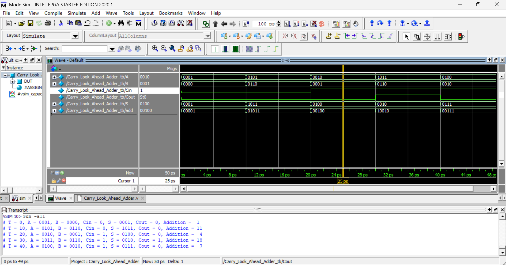

# 4-Bit Carry Look-Ahead Adder (CLA) – Verilog

## 📌 Overview
This project implements a **4-bit Carry Look-Ahead Adder (CLA)** using **Verilog HDL**.  
Carry Look-Ahead Adders improve speed by calculating carry signals in parallel rather than sequentially as in ripple-carry adders.

A complete **testbench** is included to validate the design.

---

## ⚙️ Design Concept

The CLA uses two signals:
- **Generate (G)** = A · B  
- **Propagate (P)** = A ⊕ B  

Carry equations:
```
C1 = G0 + (P0 · C0)
C2 = G1 + (P1 · C1)
C3 = G2 + (P2 · C2)
C4 = G3 + (P3 · C3)
```

---

## 🧩 Module Description

### Carry_Look_Ahead_Adder
**Inputs**
- A[3:0] : First operand  
- B[3:0] : Second operand  
- Cin    : Carry input  

**Outputs**
- S[3:0] : Sum output  
- Cout   : Carry output  

Sum calculation:
```
S = A ⊕ B ⊕ Ci
```

---

## 🧪 Testbench
The testbench applies multiple test vectors and monitors:
- Binary sum
- Carry output
- Decimal addition result

---

## ▶️ Simulation
1. Compile the design and testbench
2. Run `Carry_Look_Ahead_Adder_tb`
3. Observe output in simulation console

---

## ✅ Features
- Fast carry computation
- Clean RTL design
- Fully verified with testbench

---

## ✍️ Author Note
This project is part of Verilog HDL practice focusing on high-speed arithmetic circuits.

## Output Wavefoam



## Circuit Diagram


