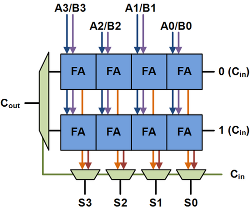
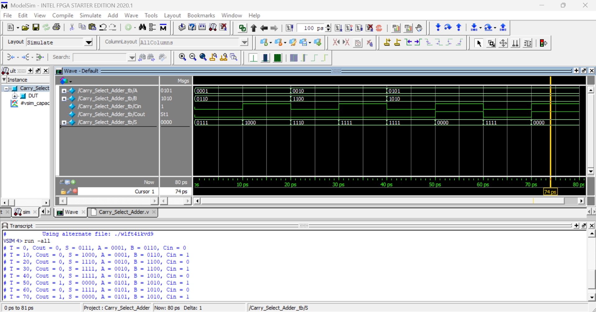

# Carry Select Adder (4-bit) – Verilog

## 📌 Overview
This project implements a **4-bit Carry Select Adder (CSA)** using Verilog HDL.  
The Carry Select Adder improves addition speed by precomputing results for both possible carry-in values (`Cin = 0` and `Cin = 1`) and selecting the correct output using multiplexers.

---

## 🧩 Modules Description

### 🔹 FA_4_bit
A 4-bit full adder that performs binary addition with carry-in.

**Operation**

{Cout, S} = A + B + Cin;

---

### 🔹 Mux_2x1
A 2×1 multiplexer used to select between two inputs.

**Operation**

Y = S ? B : A;

---

### 🔹 Carry_Select_Adder
- Computes two sums in parallel (`Cin = 0` and `Cin = 1`)
- Uses multiplexers to select the final **Sum** and **Carry**

**Blocks Used**
- 2 × `FA_4_bit`
- 5 × `Mux_2x1`

---

### 🔹 Carry_Select_Adder_tb
Testbench module to verify functionality using multiple input combinations.

**Features**
- `$monitor` for live simulation output
- Tests both carry-in cases (`Cin = 0` and `Cin = 1`)

---

## ▶️ Simulation
Run the design using any Verilog simulator (example with Icarus Verilog):

iverilog carry_select_adder.v
vvp a.out

---
## Circuit Diagram

## Output Wavefoam

---

## ✅ Advantages
- Faster than Ripple Carry Adder
- Reduced carry propagation delay
- Modular and reusable design

---

## ✍️ Author Note
This module is part of a structured Verilog practice repository focused on arithmetic circuits and performance optimization.

